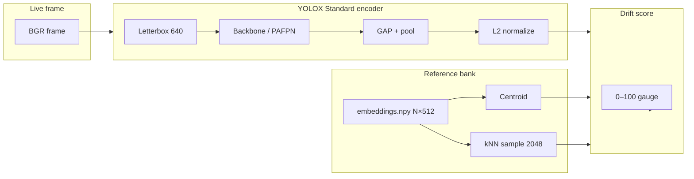

# Data Drift Module

This document describes how the False Positive Identification Agent measures **embedding-based data drift**: which reference bank is used, how live frame embeddings are computed, and how the drift score (0–100) is calculated.

---

## Overview

The app compares each video/image frame against a **reference embedding bank** built from in-distribution training data (gate / site footage). If a live frame’s embedding is far from that distribution, drift is high — useful for spotting new cameras, weather, scenes, or deployment issues before detection quality drops.



**Requirements**

| Item | Role |
|------|------|
| `embeddings.npy` | Reference bank (local file, not in Git) |
| `sakku-gate.pth` | Same YOLOX checkpoint used to build the bank |
| `yolox_voc_s 3.py` | YOLOX experiment (`Exp` class) |
| PyTorch | Drift encoder runs on `.pth`; ONNX detection alone is not enough |

---

## Reference embeddings

### What file is used?

| Setting | Default | Description |
|---------|---------|-------------|
| `drift.reference_path` | `embeddings.npy` | NumPy array of shape **`(N, 512)`** |

Also supported: `embeddings.pkl` (same layout).

Example bank size: **~69,951 × 512** — one row per training frame/image encoded with the team **YOLOX Standard** pipeline.

### How was the bank built?

The reference bank was produced by a batch script (team pipeline), equivalent to:

```bash
python build_reference_embeddings.py \
  --pth sakku-gate.pth \
  --exp "yolox_voc_s 3.py" \
  --images /path/to/training/JPEGImages \
  --output embeddings.npy \
  --input-size 640 640
```

Each row is:

1. Load image (BGR)
2. Run **YOLOX Standard** embedder (see below)
3. Append L2-normalized 512-D vector to the matrix
4. Save as `embeddings.npy`

**Important:** Live drift must use the **same checkpoint** (`sakku-gate.pth`), **same input size** (640×640), and **same pooling mode** as when the bank was built.

### What the app does with the bank

On startup, `EmbeddingDriftScorer` loads the bank and builds:

| Structure | Description |
|-----------|-------------|
| **Matrix** | All rows L2-normalized |
| **Centroid** | Mean of all rows, then L2-normalized → single 512-D vector |
| **kNN sample** | Random subset of `knn_sample_size` rows (default **2048**) for fast similarity |

Code: `fpa_agent/drift_score.py` → `ReferenceEmbeddingStore`.

---

## Live frame embedding (YOLOX Standard)

Live encoding must match the reference pipeline. The app uses **`YOLOXStandardEmbedder`** in `fpa_agent/embedding_extractor.py`.

### Pipeline steps (must match `embeddings.npy` build)

| Your training script | Live app (`embedding_extractor.py`) | Match? |
|----------------------|-------------------------------------|--------|
| Image | BGR frame from video/image | ✓ |
| Letterbox 640×640 | `letterbox_preprocess_bgr()` | ✓ |
| YOLOX Backbone | CSPDarknet (inside PAFPN or `model.backbone`) | ✓ |
| YOLOX Neck (PAFPN) | PAFPN neck (`model.neck` or `YOLOPAFPN.forward`) | ✓ |
| `AdaptiveAvgPool2d(feats, 1)` | `F.adaptive_avg_pool2d(feat, 1)` per scale | ✓ |
| Flatten | `.flatten(1)` | ✓ |
| L2 normalize | `F.normalize(..., dim=0)` | ✓ |

**Stock YOLOX note:** `model.backbone` is **`YOLOPAFPN`** (CSPDarknet + PAFPN in one module). That is still **backbone → neck** logically; the app calls `_forward_backbone_and_neck()` which uses `model.neck` when present, else `model.backbone(x)` (full PAFPN).

**512-D bank (~69k images):** use `pool_mode: "last_scale"` — GAP on the **finest PAFPN map** (512 channels for YOLOX-S width 0.5). Multi-scale concat would be **896-D**, which does not match your `embeddings.npy`.

| Step | Behavior |
|------|----------|
| **1. Preprocess** | Letterbox to **640×640**, BGR→RGB, pad **114**, CHW **float32**, **no `/255`** |
| **2. Forward** | Backbone → Neck (PAFPN) via `_forward_backbone_and_neck()` |
| **3. Pool** | `adaptive_avg_pool2d` on each PAFPN scale |
| **4. Combine** | `last_scale` (512-D) or `concat_all` (896-D) — see `pool_mode` |
| **5. Output** | L2-normalized vector (`float32`) |

### Model layout (stock YOLOX)

In this repo’s YOLOX, **`YOLOPAFPN` is `model.backbone`** — there is no separate `.neck`. The backbone output is already fused multi-scale features (P3, P4, P5).

If a checkpoint exposes both `backbone` and `neck`, the embedder runs `neck(backbone(x))` like the team script.

### Pooling modes (`pool_mode`)

YOLOX-S PAFPN channels per scale: **128 + 256 + 512 = 896** if all scales are concatenated. The reference bank is **512-D**, so the default handles this automatically:

| Mode | Behavior |
|------|----------|
| **`auto`** (default) | Concat all scales only if total dim = 512; otherwise use **last scale** (512 channels) |
| `concat_all` | Always concat all scales (896-D for YOLOX-S — only if bank was built that way) |
| `last_scale` | Always use finest PAFPN scale only (512-D) |

Encoder label in UI example: `YOLOX PAFPN last_scale @ 640x640`.

### Detection vs drift preprocess

These are **intentionally different**:

| | Detection | Drift |
|---|-----------|-------|
| Preprocess | YOLOX `preproc` (train/test augment path) | Letterbox 640, pad 114, no `/255` |
| Purpose | Bounding boxes + NMS | Embedding similarity |

Same weights (`sakku-gate.pth`), different input path for drift only.

### Weights and encoder config

```json
"drift": {
  "reference_path": "embeddings.npy",
  "encoder": "yolox_standard",
  "input_size": [640, 640],
  "pool_mode": "last_scale",
  "expected_dim": 512,
  "knn_sample_size": 8192
}
```

| Key | Description |
|-----|-------------|
| `drift.encoder` | `yolox_standard` (default). |
| `drift.input_size` | `[640, 640]` — must match bank build. |
| `drift.pool_mode` | `last_scale` for 512-D bank; `concat_all` only if bank is 896-D. |
| `drift.expected_dim` | `512` — sanity check vs live embedding size. |
| `drift.knn_sample_size` | **8192** recommended for ~**69k** reference rows (~12% sample). Use `2048` for faster CPU; `0` = use full bank (slow). |

**No** `projection_weights` / `drift_projection.pth` — the standard pipeline has no learned projection head.

---

## Drift score calculation

For each frame:

### 1. Encode and normalize

```
emb = YOLOXStandardEmbedder(frame)   # shape (512,)
emb = emb / ||emb||                  # L2 normalize again (safety)
```

### 2. Centroid cosine similarity

```
cos_centroid = dot(emb, centroid)    # both unit vectors, range [-1, 1]
dist_centroid = max(0, 1 - cos_centroid)
```

### 3. kNN mean similarity

```
sims = sample_matrix @ emb           # cosine sim to each of 2048 ref vectors
knn_mean_sim = mean(sims)
dist_knn = max(0, 1 - knn_mean_sim)
```

### 4. Combined drift (0–100)

```
drift_raw = 0.6 * dist_centroid + 0.4 * dist_knn
drift_score = min(100, drift_raw * 100)
```

| Component | Weight | Meaning |
|-----------|--------|---------|
| Centroid distance | **60%** | How far from the “average” training look |
| kNN distance | **40%** | How far from typical individual training frames |

### 5. Bank mismatch flag

If **`cos_centroid < 0.2`** and **`knn_mean_sim < 0.2`**, the UI shows a **bank mismatch** warning — usually wrong checkpoint, wrong encoder, or wrong `embeddings.npy`, not genuine scene drift.

---

## Interpreting the UI

The left panel shows:

| Field | Good / normal | Concerning |
|-------|----------------|------------|
| **Drift score** | 0–15 in-distribution; 15–35 unseen same domain | 70–100 with low cos/kNN |
| **cos(ref)** | > 0.7 training; 0.65–0.8 unseen OK | < 0.2 (mismatch) |
| **kNN sim** | > 0.70 training; 0.60–0.72 unseen OK | < 0.5 when you expect in-distribution |

### Score bands

| Drift score | Typical meaning |
|-------------|-----------------|
| **0–15** | In-distribution (training / gate footage) |
| **15–35** | Unseen but same domain (new angle, lighting) — ~22 is normal |
| **35–70** | Noticeable shift (different scene, heavy weather) |
| **70–100** | Strong OOD or encoder/bank mismatch |

### Gauge colors

| Score | Color |
|-------|-------|
| < 25 | Green (low) |
| 25–55 | Yellow (medium) |
| ≥ 55 | Red (high) |

### Example numbers

If `cos_centroid = 0.82` and `knn_mean_sim = 0.70`:

```
dist_centroid = 1 - 0.82 = 0.18
dist_knn      = 1 - 0.70 = 0.30
drift_raw     = 0.6×0.18 + 0.4×0.30 = 0.228
drift_score   ≈ 22.8
```

That is healthy for unseen but similar footage.

---

## Runtime flow in the app

1. **Startup** — `DriftLoaderThread` loads `embeddings.npy` into `EmbeddingDriftScorer`.
2. **Model load** — `ModelLoaderThread` loads `sakku-gate.pth` + exp file.
3. **Attach** — `attach_yolox_model()` wires `DetectionModel.encode_frame_embedding()` as the live encoder.
4. **Per frame** — `VideoThread` / `ImageProcessThread` calls `score_frame()` and emits drift to the UI gauge.

If only ONNX is loaded, drift stays in “waiting for .pth” unless a dedicated embed ONNX is added (not part of standard pipeline today).

---

## Local files (not in Git)

Place these in the project folder (or set absolute paths in `config.json`):

| File | Size (approx) | Purpose |
|------|---------------|---------|
| `embeddings.npy` | ~137 MB | Reference bank |
| `sakku-gate.pth` | ~69 MB | Weights for detection + drift |
| `yolox_voc_s 3.py` | small | YOLOX experiment |

Optional: `embeddings.pkl` instead of `.npy`.

---

## Rebuild reference bank

When you have new training images or change checkpoint:

```bash
python build_reference_embeddings.py \
  --pth sakku-gate.pth \
  --exp "yolox_voc_s 3.py" \
  --images /path/to/images_or_video \
  --output embeddings.npy \
  --input-size 640 640
```

The script prints a mean cosine-to-centroid sanity check after build. Expect high internal consistency if the pipeline is correct.

---

## Troubleshooting

| Symptom | Likely cause | Fix |
|---------|--------------|-----|
| Drift stuck at **100**, cos ≈ **0** | Live encoder ≠ bank pipeline | Use `yolox_standard`, `sakku-gate.pth`, 640×640 |
| **Bank mismatch** warning | Wrong `.pth` or wrong `embeddings.npy` | Align checkpoint and rebuild bank |
| Drift **waiting for .pth** | ONNX-only model loaded | Load PyTorch `sakku-gate.pth` for drift |
| Drift ~**22** on unseen images | Normal same-domain shift | Check cos > 0.6 and kNN > 0.6 |
| cos > **0.8**, low drift | Strong in-distribution match | Expected on training-like footage |
| Dim warning 896 vs 512 | Concat vs last-scale mismatch | Keep `pool_mode: auto` or rebuild bank |

---

## Code map

| File | Role |
|------|------|
| `fpa_agent/embedding_extractor.py` | `letterbox_preprocess_bgr`, `YOLOXStandardEmbedder` |
| `fpa_agent/drift_score.py` | Reference load, centroid/kNN, drift formula |
| `fpa_agent/detection_model.py` | `_init_drift_embedder()`, `encode_frame_embedding()` |
| `fpa_agent/widgets.py` | `DriftGaugeWidget` UI |
| `fpa_agent/threads.py` | `DriftLoaderThread`, per-frame `score_frame()` |
| `build_reference_embeddings.py` | Rebuild `embeddings.npy` |

---

## Legacy / out of scope

- **`YOLOXLegacyDriftEmbedder`** — old hook + projection MLP (416×416). Do not use with current `embeddings.npy`.
- **ResNet-18 fallback** — `drift.encoder = "resnet"` only; not comparable to YOLOX bank.
- **ONNX drift** — requires exporting backbone+PAFPN+pool graph; deferred. Use `.pth` for drift today.

See also: `README_CONFIG.md` for full `config.json` keys.
